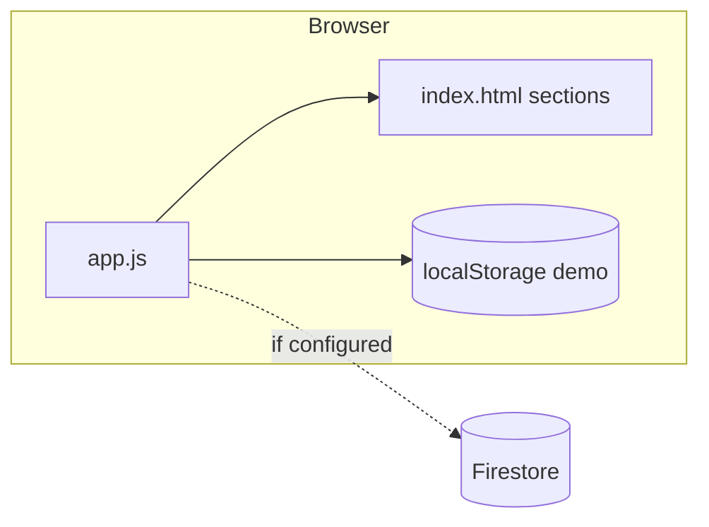

# CLAUDE.md — AI Context File

> This file gives AI assistants (Claude, Cursor, Copilot, etc.) the context they need to work effectively in this codebase. Keep it updated.

---

## 1. Project Identity

- **Name**: Sahayak
- **Purpose**: Accessibility-focused mobile web app with user/caregiver roles, disability-specific quick actions, voice/camera/OCR tools, optional Firebase backend, and demo mode via localStorage.
- **Repo**: _(add Git URL when available)_
- **Status**: _(e.g. prototype / alpha)_
- **Primary audience**: End users needing visual, hearing, or motor assistance; caregivers monitoring linked users.

---

## 2. Tech Stack

| Layer | Technology | Notes |
|-------|------------|--------|
| Language | JavaScript (ES6+) | Single `app.js`, no transpiler |
| UI | HTML5 + CSS3 | `index.html`, `style.css`; CSS variables, flex/grid |
| Runtime | Browser only | No Node build step; no `package.json` |
| Backend (optional) | Firebase | **v9.23 compat**: Auth + Firestore (`firebase-app`, `firebase-auth`, `firebase-firestore` from gstatic CDN) |
| OCR | Tesseract.js | v4 from jsDelivr CDN |
| Fonts | Google Fonts | Inter, Playfair Display |

**Key third-party services**

- **Firebase** (when `firebaseConfig` in [`app.js`](../app.js) is filled with real keys): Firestore collections `users`, `caregivers`, `activity_logs`, `alerts`.
- **Tesseract.js**: client-side OCR on uploaded images (`eng`).

**Browser APIs in use**

- Web Speech: `SpeechRecognition` / `webkitSpeechRecognition`, `speechSynthesis`
- Media: `getUserMedia` (scene camera)
- Canvas 2D (frame capture)
- Web Audio (`AudioContext`, `AnalyserNode`) for sound-alert mode
- `navigator.vibrate`, `localStorage`, `URL.createObjectURL`

---

## 3. Repository Layout

```
/
├── index.html          # All screens as sections; script/style links; CDN scripts
├── style.css           # Global + component styles, CSS icon pseudo-elements
├── app.js              # All application logic (~2.2k lines)
└── docs/
    └── claude.md       # This file
```

**Entry points**

- **UI structure & assets**: [`index.html`](../index.html)
- **Behaviour**: [`app.js`](../app.js) (DOM map `ui`, `showScreen`, event bindings, data layer)
- **Styling**: [`style.css`](../style.css)

---

## 4. Dev Workflow

### Setup

There is no install step. Serve the folder over HTTP (recommended for `getUserMedia`, mic, and some speech APIs):

```bash
# examples — use any static server
npx --yes serve .
# or: python -m http.server 8080
```

Open the URL the tool prints (e.g. `http://localhost:3000`). Opening `index.html` via `file://` may break camera/mic in some browsers.

### Firebase (optional)

1. Create a Firebase project; enable Email/Password auth and Firestore.
2. Replace placeholders in `firebaseConfig` at the top of [`app.js`](../app.js).
3. Add Firestore **security rules** and **composite indexes** as needed. Queries use patterns like `activity_logs` / `alerts` with `where('userId','==', id).orderBy('timestamp','desc')` — typically requires a composite index.

If config stays as `YOUR_*` placeholders, the app runs in **demo mode** (localStorage-backed users, activity, alerts).

### Common adjustments

- **Status line**: `#app-status` reflects Connected vs Demo mode.
- **Logout**: clears recognition, TTS, camera, sound detection, and demo session keys as implemented in `logout()`.

---

## 5. Architecture



### Screen navigation

- Full-screen **sections** (`.app-screen`); exactly one has `.is-active`.
- `showScreen(key)` maps keys like `userHome`, `login`, `onboarding` to section IDs.
- Bottom **nav** visible only for post-auth main flows (`nav-hidden` on shell otherwise).

### Dual data mode

- `MODE.firebase` is set at startup if `isFirebaseConfigured()` is true.
- Functions such as `dataSignIn`, `getUserProfile`, `addActivityLog`, `createEmergencyAlert`, `listActivityLogs` branch on `MODE.firebase` vs demo `localStorage` keys (`LS.session`, `LS.demoUsers`, `LS.demoActivity`, etc.).

### Roles and domains

- **User**: after auth, may need **disability** selection; `DOMAIN_CONFIG` drives dashboard subtitle and four **quick action** labels (`data-feature-label` / `data-feature-key`).
- **Caregiver**: links user by email (`findUserUidByEmail`); dashboard reads that user’s activity and alerts.

### Speech / shared recognition

- Single shared `SpeechRecognition` instance (`speechRec`) with modes: `voice_nav`, `live_stt`, `voice_cmd`. Switching modes calls `stopSharedRecognition` to avoid overlap.
- Separate instances exist for **voice action** and **compound voice** (`startVoiceAction`, `handleCompoundVoice`).

### Feature realism (for AI maintainers)

- **Scene description**: camera is real; **text description is simulated** (random preset strings), not CV/ML.
- **Emotion / summarizer**: heuristic / simple text rules and popups, not an external AI API.

---

## 6. Code Conventions (this repo)

### Patterns in `app.js`

- **`$` / `qs` / `qsa`**: thin DOM helpers at top.
- **`ui` object**: single map of important elements; keep new IDs wired here if you add UI.
- **`state`**: session-ish client state (user, role, disability, caregiver link, flags).
- **Async data**: prefer existing `upsertUserProfile`, `logActivity`, etc., rather than duplicating Firestore/localStorage logic.

### HTML

- Prefer **semantic sections** with `aria-label` / `aria-live` where already used.
- New buttons that should appear in **screen reader** full-page read: content must live inside the active `.app-screen` (see `getActiveScreenText()`).

### CSS

- Design tokens in **`:root`** (`--primary`, `--card`, `--pad`, …). Match existing spacing and component classes (`app-card`, `app-button`, `pick-card`) when extending UI.

### Naming

- Follow existing file style: **camelCase** in JS for functions/variables, **kebab-case** for CSS classes and HTML `id`s where the project already uses them.

---

## 7. Gotchas & Hard Rules

### Never do this

- Do not **commit real Firebase API keys** or secrets in `app.js`.
- Do not **import Prisma / Node APIs** — this is a static client app.
- Avoid **second simultaneous** `SpeechRecognition` sessions without stopping the shared one; causes flaky behaviour.
- Do not assume **file://** works for all features; prefer HTTP.

### Firestore

- Demo mode does not validate security rules — production needs **rules** that match `users`, `caregivers`, `activity_logs`, `alerts` access patterns.
- `orderBy` + `where` queries may **fail until indexes** are created (Firebase console link in error).

### Known quirks

- `hideEmotionSummaryPanels()` hides inline emotion/summary DOM nodes on init; some results use **popups** (`showPopup`) instead.
- Caregiver **inactivity** line is a simple threshold (~10 minutes since last log), not a push notification system.
- Emergency flow: `createEmergencyAlert()` + user alert; caregiver sees entries from `alerts` collection / demo list.

---

## 8. Testing

- **No automated test runner** in this repository yet.
- Manual checks: login (demo: any email/password), role/disability flows, quick actions per `DOMAIN_CONFIG`, caregiver link, activity list, SOS button.

---

## 9. AI Guidance

### When generating code

- Match **existing structure** in the file you edit (especially `app.js` organisation: data layer, feature functions, `bindEvents`).
- Keep changes **scoped** to the requested behaviour; avoid drive-by refactors across the whole 2k-line file.
- New UI: update **`index.html`**, **`style.css`**, and the **`ui`** map + **`bindEvents`** in **`app.js`** so nothing is orphaned.

### When suggesting infrastructure

- **PWA**, **bundler**, **TypeScript**, or **tests** are improvements, not current facts — call them out explicitly as new work.

### Sensitive areas

- **`firebaseConfig`**: only placeholder edits or env-driven loading with human review for production.
- Changing **activity log feature slug strings** may break `executePredictiveFeature` / `predictiveMode` unless mappings stay in sync.

---

*Last updated: 2026-04-12 · Owner: _(team or person)_*
